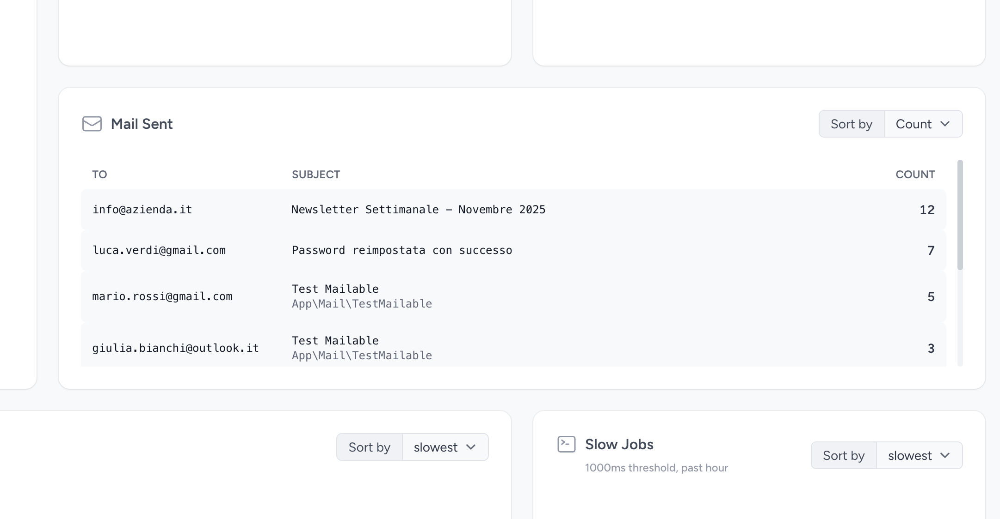

<p align="center">
    
</p>

<p align="center">
    <a href="https://github.com/Oltrematica/laravel-pulse-mail/actions/workflows/run-tests.yml"></a>
    <a href="https://github.com/Oltrematica/laravel-pulse-mail/actions/workflows/phpstan.yml"></a>
    <a href="https://packagist.org/packages/oltrematica/laravel-pulse-mail"></a>
    <a href="https://packagist.org/packages/oltrematica/laravel-pulse-mail"></a>
</p>

# Laravel Pulse Mail

Track and monitor emails sent from your Laravel application directly in your Laravel Pulse dashboard.

This package provides a custom Pulse widget that displays sent emails with details including recipients, subjects, mailable classes, and send counts. Perfect for monitoring email activity and debugging mail-related issues in production.



## Features

- 📧 **Track all sent emails** - Automatically records emails sent via Laravel Mail
- 🎯 **Detailed information** - Shows recipient, subject, mailable class, and send count
- ⚙️ **Configurable filtering** - Exclude specific emails or mailables from tracking
- 📊 **Sample rate control** - Track a percentage of emails for high-volume applications
- 🕐 **Time-based filtering** - Uses Pulse's built-in date filtering
- 🎨 **Consistent UI** - Matches Pulse's design language

## Requirements

- PHP 8.3+
- Laravel 10.x, 11.x, or 12.x
- Laravel Pulse 1.x

## Installation

### Step 1: Install the Package

Install the package via Composer:

```bash
composer require oltrematica/laravel-pulse-mail
```

### Step 2: Publish Configuration Files

Publish the package configuration file:

```bash
php artisan vendor:publish --tag=pulse-mail-config
```

If you haven't already published the Pulse dashboard view, publish it as well:

```bash
php artisan vendor:publish --tag=pulse-dashboard
```

### Step 3: Configure Pulse Recorder

Add the mail recorder to your `config/pulse.php` file in the `recorders` array:

```php
'recorders' => [
    // ... other recorders

    \Oltrematica\Pulse\Mail\Recorders\MailSentRecorder::class => [
        'enabled' => env('PULSE_MAIL_ENABLED', true),
    ],
],
```

### Step 4: Add Widget to Dashboard

Add the mail-sent widget to your Pulse dashboard in `resources/views/vendor/pulse/dashboard.blade.php`:

```blade
<x-pulse>
    <livewire:pulse.servers cols="full" />

    <livewire:pulse.usage cols="4" rows="2" />

    <livewire:pulse.queues cols="4" />

    <livewire:pulse.cache cols="4" />

    {{-- Custom: Mail Sent Widget --}}
    <livewire:pulse.mail-sent cols="8" />

    <livewire:pulse.slow-queries cols="8" />

    <livewire:pulse.slow-jobs cols="4" />

    <livewire:pulse.slow-requests cols="full" />

    <livewire:pulse.exceptions cols="6" />

    <livewire:pulse.slow-outgoing-requests cols="6" />
</x-pulse>
```

You can customize the widget size using the `cols` and `rows` attributes. Common configurations:
- `cols="full"` - Full width
- `cols="8"` - 2/3 width
- `cols="6"` - Half width
- `cols="4"` - 1/3 width

## Configuration

The `config/pulse-mail.php` file provides several options:

```php
return [
    // Maximum number of emails to display in the widget
    'limit' => env('PULSE_MAIL_LIMIT', 10),

    // Email addresses to exclude from tracking
    'ignore' => [
        'to' => [
            // 'test@example.com',
        ],
    ],

    // Mailable classes to exclude from tracking
    'ignore_mailables' => [
        // \App\Mail\TestEmail::class,
    ],

    // Sample rate (0-1): 1 = track all emails, 0.5 = track 50%
    'sample_rate' => env('PULSE_MAIL_SAMPLE_RATE', 1),
];
```

## Usage

Once installed and configured, the package will automatically start tracking emails sent through Laravel's Mail facade or Mailable classes. The widget will display:

- **To**: Email recipient address(es)
- **Subject**: Email subject line
- **Mailable**: The Mailable class used (if applicable)
- **Count**: Number of times this email was sent during the selected period

### Filtering

The widget respects Pulse's time-based filtering. Use the Pulse dashboard controls to filter emails by time period (last hour, 24 hours, 7 days, etc.).

### Ignoring Specific Emails

To exclude certain emails from tracking, add them to the configuration:

```php
// Ignore by recipient
'ignore' => [
    'to' => [
        'test@example.com',
        'noreply@example.com',
    ],
],

// Ignore by Mailable class
'ignore_mailables' => [
    \App\Mail\TestEmail::class,
    \App\Mail\InternalNotification::class,
],
```

### Sample Rate

For high-volume applications, you can track only a percentage of emails:

```php
// Track 50% of emails
'sample_rate' => 0.5,

// Or use environment variable
'sample_rate' => env('PULSE_MAIL_SAMPLE_RATE', 1),
```

## Code Quality

The project includes automated tests and tools for code quality control.

### Rector

Rector is a tool for automating code refactoring and migrations. It can be run using the following command:

```shell
composer refactor
```

### PhpStan

PhpStan is a tool for static analysis of PHP code. It can be run using the following command:

```shell
composer analyse
```

### Pint

Pint is a tool for formatting PHP code. It can be run using the following command:

```shell
composer format
```

### Automated Tests

The project includes automated tests and tools for code quality control.

```shell
composer test
```

## Contributing

Feel free to contribute to this package by submitting issues or pull requests. We welcome any improvements or bug fixes
you may have.

